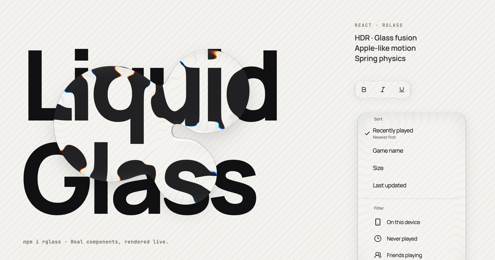

# React Liquid Glass

**HDR · Glass fusion · Apple-like motion · Spring physics**



A React component library built on project-owned liquid glass optics and physical motion. This repository is an npm-workspaces monorepo.

[npm package](https://www.npmjs.com/package/rglass) · [Live documentation](https://react-liquid-glass-alpha.vercel.app/)

- **`packages/react-liquid-glass`** — the independently buildable `rglass` package, including the `liquid-glass` and `apple-motion` cores, React components, optional styles, and declarations.
- **`apps/docs`** — the documentation site: homepage, interactive component catalog, individual usage/API pages, shared-material Playground, and three working showcase applications.
- **`tests`** — cross-workspace optical regression checks and the existing Sites worker checks.

The docs app imports public package entry points. Development aliases enable source HMR; production builds consume the built library package. Neither core imports documentation, example content or the other core.

## Develop

```sh
npm ci
npm run dev
```

The documentation site runs at `http://localhost:32472`.

```sh
npm run check       # Type-check both workspaces
npm test            # Library, documentation examples, optical regressions
npm run build       # Build the library, then the docs site
npm run preview     # Preview the production site
npm run build:lib    # Build only the reusable package
```

Production output: `packages/react-liquid-glass/dist` for the library; `dist/client` for the site. Node.js 22.18+ is required for the repository tests; deployment uses Node.js 24.

## Use the library

Install the package from npm:

```sh
npm install rglass react@^19 react-dom@^19 motion@^13
```

```tsx
import { GlassButton, GlassStage } from "rglass/controls";
import { LiquidGlassProvider } from "rglass/liquid-glass";
import "rglass/controls.css";

export function Example() {
  return (
    <LiquidGlassProvider material={{ chromaAmount: 0.24 }}>
      <GlassStage style={{ padding: 48 }}>
        <GlassButton onClick={() => console.log("Pressed")}>Continue</GlassButton>
      </GlassStage>
    </LiquidGlassProvider>
  );
}
```

See the [package README](packages/react-liquid-glass/README.md) for entry points and rendering boundaries.

## Documentation & playground

- `/components` — live catalog with category filters and a shared-material inspector.
- `/components/:component` — individual previews, complete copyable examples and API reference.
- `/playground` — 21 numeric renderer parameters, lens profile and light source, and the live optical field; presets, per-component/all-component views, grid, lines, photo and text substrates, a side-by-side comparison with the defaults, a frame-rate readout, local persistence, reset, copied code and shareable URLs.
- `/showcase/focus` — a deadline-based focus timer with local notes.
- `/showcase/sequencer` — an eight-step, four-note Web Audio instrument.
- `/showcase/orbit` — direct manipulation with momentum, edge resistance, surface tension and shared-SDF fusion.
- `/docs/installation` — package setup, core boundaries and usage.
- `/docs/:guide` — theming, material and HDR, motion, renderer, performance, accessibility, browser support and server rendering.

The site supports persisted English/Chinese and light/dark preferences; without a saved choice the theme follows the system. The header's HDR toggle is shared across pages, independent of material presets, and available on supported displays. All showcase interactions run locally; the sequencer only starts audio after a user action.

## Deployment

GitHub Actions checks types, runs the existing tests, builds the docs and validates the package contents on pull requests and pushes to `main`.

The existing Vercel project remains linked to this repository at its root. `vercel.json` installs all workspaces, runs `npm run build:demo`, serves `dist/client`, and rewrites documentation deep links to the SPA. Keep the Vercel Root Directory empty; do not point it at the library package.

The existing Sites adapter is retained unchanged. A Sites handoff uses `npm run build:sites` and `npm run test:sites`; it additionally requires the environment-provided, ignored `.openai/hosting.json`. It is not needed for Vercel.

## License

MIT. See [LICENSE](LICENSE).
